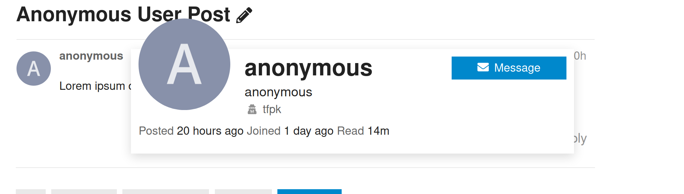
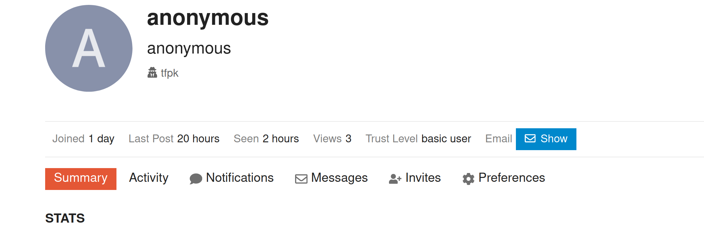

# discourse-reveal-anonymous

Allows anonymous users to have their true identity revealed by staff.

This plugin adds a small note to an anonymous user's profile, and to any cards that display their info.

## Examples

In each case, the user "anonymous" is actually "tfpk". You can see their real name next to an icon.

### Card Example

In this case, clicking "tfpk" will take you to his profile.

### Profile Example

In this case, clicking "tfpk" will show a card with a summary of the user.

## Security

This plugin (even when not enabled) adds a `master_user` field to the json description of a user.
If not enabled, or the user is not an anonymous account, or the logged in user is not allowed to reveal
anonymous accounts, `master_user` is null. As a result:

 - It is possible for any user to tell this plugin is installed
 - It should not be possible for any non-staff user to get any extra information about an anonymous user from this plugin. If you find a bug, please submit a PR, or an issue.
 
## Credit

This plugin was based on the [Discourse Anonymous Moderators plugin](https://github.com/discourse/discourse-anonymous-moderators/).
